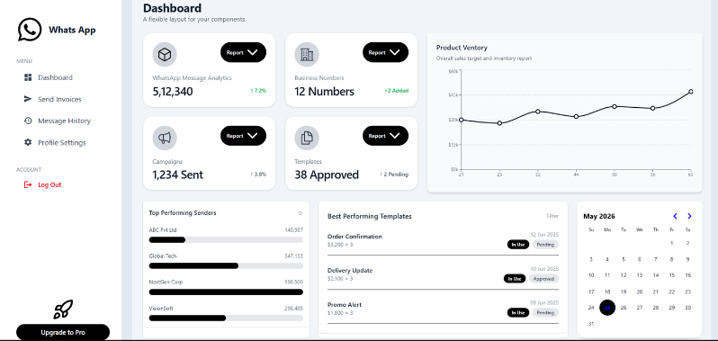
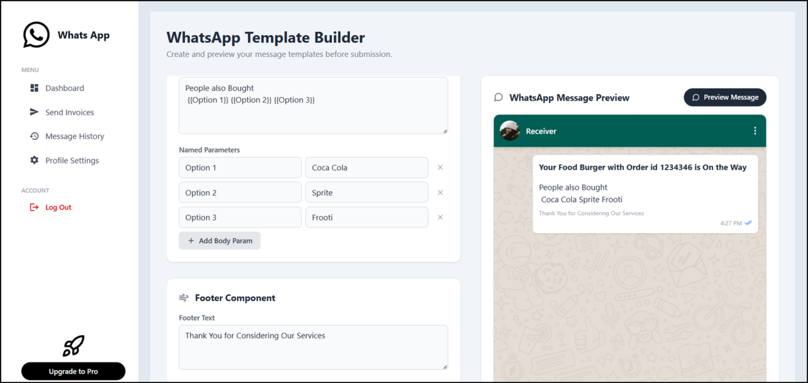
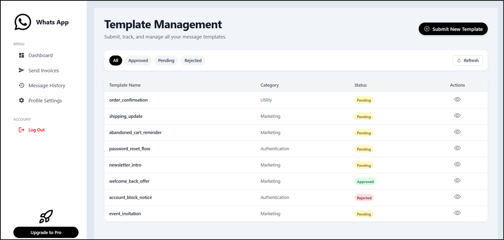
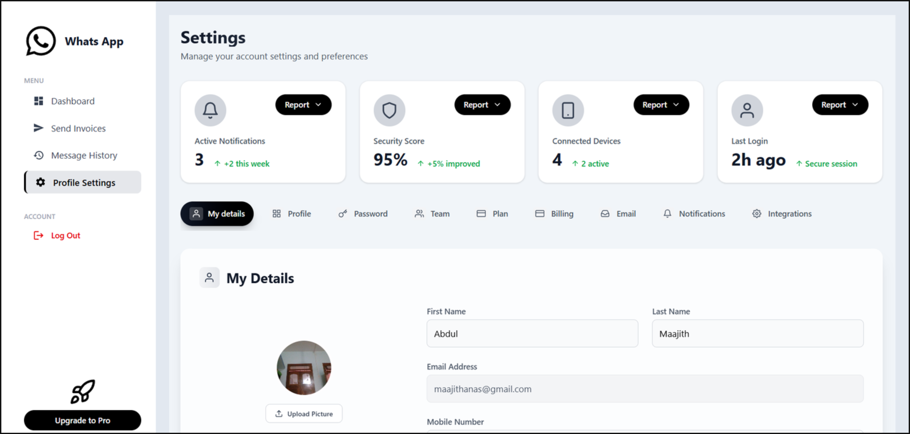
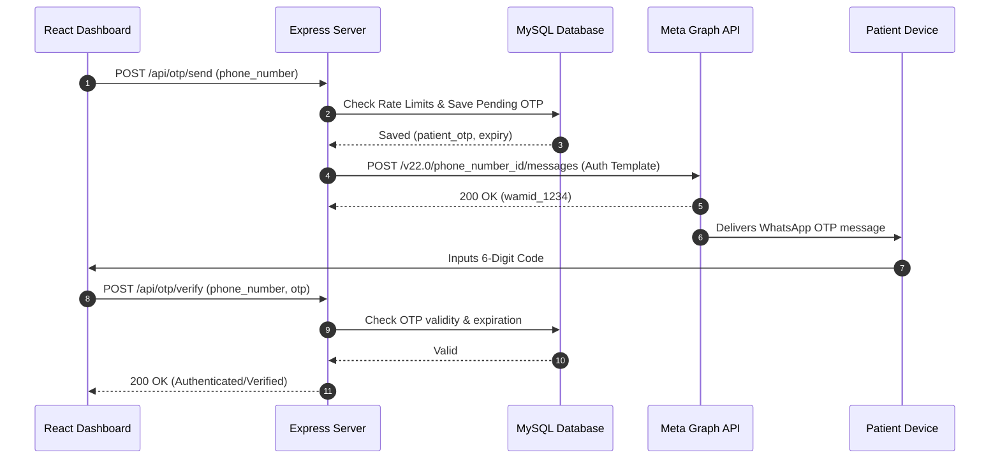

# WhatsApp Business Client

A clean multi-tenant dashboard for WhatsApp Business API. Send invoices, manage templates, track analytics, and handle customer communication.

### Screenshots





### Tech Stack
- React + Vite
- Tailwind CSS
- Meta WhatsApp Business API


## Why WhatsApp Business MAAS?

Modern healthcare and commerce workflows require direct, reliable, and high-engagement communication. Traditional SMS delivery suffers from low deliverability and exorbitant costs, while custom notification systems depend on users keeping proprietary apps installed.

WhatsApp Business MAAS solves this by bridging server-side transactional triggers directly with the Meta Cloud API. By decoupling notification logic, patient OTP flow, and invoice distribution from the core applications, MAAS offers a highly secure, reliable, and multi-tenant communications hub.

- **Verified Patient OTP Delivery** &mdash; 6-digit OTP delivery directly through WhatsApp Authentication templates with sub-second delivery times.
- **Transactional Invoice Distribution** &mdash; Dynamic PDF attachment hosting and distribution via automated WhatsApp template triggers.
- **Multi-Tenant Credentials** &mdash; Securely manages distinct WhatsApp access tokens, phone numbers, and template schemas per user account.
- **Robust Local Staging & Logging** &mdash; Two-step binary uploads and webhook ingestion logs capture comprehensive delivery audits.
- **Resilient Webhook Handlers** &mdash; Listens to real-time status updates (Sent, Delivered, Read) to monitor message pipelines.

---

## How It Works

WhatsApp Business MAAS utilizes a unified client-server architecture to automate WhatsApp communication workflows:



1. **Meta WABA Template Pipeline** &mdash; Transactional messages are sent using pre-approved Meta WABA templates. The backend dynamic engine packages parameters into standard template JSON payloads and forwards them to the Meta Graph API.
2. **Cookie-Authenticated Sessions** &mdash; The dashboard communicates securely with the backend using JWT Access and Refresh tokens stored in `httpOnly`, `secure`, `SameSite=None` cookies, preventing cross-site scripting (XSS) payload interception.
3. **Dual-Layer Media Ingestion** &mdash; When distributing PDFs (e.g. invoices), files are temporarily staged via a Multer pipeline, uploaded using Meta's 2-step Graph uploads API to generate a file handle, and then attached to the template payload.

---

## Vision

**Frictionless Transactional Reach.** Eliminating the friction of delivery by utilizing the world's most popular messaging app. 

**Decoupled & Highly Scalable.** MAAS serves as a central infrastructure utility, exposing simple REST APIs for other systems to trigger WhatsApp flows without knowing the underlying Meta API complexities.

**Absolute Security & Auditability.** Ensuring that cryptographic secrets, HIPAA-sensitive patient phone numbers, and financial invoices are locked behind strict JWT auth boundaries and detailed log streams.

---

## Tech Stack

| Layer | Technology |
|---|---|
| **Frontend Core** | React 19, Vite, Redux Toolkit, Axios, TailwindCSS |
| **Backend Core** | Node.js, Express, JWT (`httpOnly` cookies), CORS, Multer |
| **Database** | MySQL via `mysql2` (Connection Pool & Promises) |
| **Messaging Provider**| Meta WhatsApp Cloud Business API (v22.0) |
| **Email Services** | Resend API (Email verification and password resets) |
| **Styling & UI** | TailwindCSS, Tailwind Utilities, React-Toastify |
| **Tooling & Build** | Bun, npm, VS Code Workspace Counters |

---

## Architecture

```
WhatsAppMVP/
├── Whatsapp-Business-MAAS-Client/    # React (Vite) Frontend
│   ├── public/                        # Static assets & icons
│   └── src/                           # Frontend Source
│       ├── assets/                    # Styled images & global logos
│       ├── components/                # Shared UI Components (Modals, Forms, Alerts)
│       ├── constants/                 # Routing constants & API endpoints
│       ├── context/                   # Global AuthContext (Authentication checks)
│       ├── features/                  # Specific UI modules (Templates, Analytics)
│       ├── hooks/                     # Custom hooks for API state
│       ├── ReduxStates/               # Redux slices for global data synchronization
│       ├── services/                  # Axios service clients for backend communication
│       ├── utils/                     # Formatting utilities & visual helpers
│       ├── App.jsx                    # Routing mapping & root layout
│       └── main.jsx                   # React entry point
│
├── Whatsapp-Business-MAAS-Server/    # Node.js Express Backend
│   └── Whatsapp-Business-MAAS-Server/ # Core Server Root
│       ├── config/                    # database.js, multer.js, sendEmail.js
│       ├── controllers/               # Auth, Invoices, Templates, and OTP Controllers
│       ├── logs/                      # webhook.log & system diagnostics
│       ├── middleware/                # JWT Auth middleware, Rate limiters, Cors guards
│       ├── models/                    # SQL Database Access Layer (Users, Invoices, Credentials)
│       ├── routes/                    # API endpoints (Auth, Webhook, Credentials, OTP)
│       ├── schema/                    # create-tables.sql (MySQL DB Schema)
│       ├── services/                  # whatsappService.js (Meta API client)
│       ├── utils/                     # HTML Email templates & OTP generators
│       ├── app.js                     # Express app configurations
│       └── server.js                  # HTTP Server bootstrapper
│
├── AI_CONTEXT.md                      # Persistent LLM memory map
├── ONE_WEEK_FEASIBILITY_REPORT.md     # OTP feasibility analysis
└── OTP_ANALYSIS_REPORT.md             # In-depth architectural blueprint
```

---

## Engineering & Implementation Highlights

### 1. One-Week OTP Verification Engine
To support secure patient verification, a dual-endpoint validation model is built atop MySQL:
* **Rate Limiting:** Protects backend routes against brute-force verification and spamming by enforcing a maximum of 3 OTP requests per 10 minutes per IP/number.
* **Cryptographic Randomizer:** Generates 6-digit cryptographic-grade secure numerical codes with customizable lifespan windows (e.g., 5-minute TTL).
* **Database Isolation:** A dedicated `patients` table maintains phone hashes and expiration logs, isolated from administrative dashboard users.

```sql
CREATE TABLE patients (
  id INT AUTO_INCREMENT PRIMARY KEY,
  phone_number VARCHAR(20) NOT NULL UNIQUE,
  patient_otp VARCHAR(6) DEFAULT NULL,
  patient_otp_expiry DATETIME DEFAULT NULL,
  otp_verified BOOLEAN DEFAULT FALSE,
  created_at TIMESTAMP DEFAULT CURRENT_TIMESTAMP,
  INDEX idx_phone (phone_number)
);
```

### 2. Multi-Tenant WABA Credential Mapping
Dashboard administrators can dynamically register distinct Meta access tokens and Business Account IDs.
* **Surgical Decoupling:** Requests are routed dynamically using the credentials associated with the authenticated user's ID (`request.user.credentialid`), ensuring complete tenant data isolation.
* **Dynamic Geolocation Defaulting:** Enables distinct fallback configurations per tenant when routing transactional messages.

### 3. Two-Step Meta Graph Upload API
To distribute invoices, the system bypasses standard payload boundaries by using Meta's chunked media uploads:
1. **Multer Staging:** PDF documents are processed, and basic size limits are checked (capped at 10MB).
2. **Session Creation & Graph Upload:** The system executes an initial request to create an upload session on Meta's server, transfers the binary stream, and retrieves an immutable `h` (file handle) ID.
3. **Template Binding:** The handle ID is bound into the WABA message payload template parameters under `header` components.

---

## Security & Verification Notice

To guarantee maximum compliance and security:
* **Environment Separation:** Meta API access tokens, MySQL database passwords, and JWT secret keys must never be hardcoded and must only be injected via `.env` configurations.
* **Cookie Isolation:** The JWT access tokens are flagged with `SameSite=None` and `HttpOnly` to eliminate script-based theft.
* **Verify Token Hardening:** Ensure the webhook verify token used to validate subscription requests from Meta is generated using a secure random string and matched dynamically in production.

---

## Acknowledgements

<table align="center">
  <tr>
    <td align="center"><a href="https://react.dev/"></a></td>
    <td align="center"><a href="https://expressjs.com/"></a></td>
    <td align="center"><a href="https://www.mysql.com/"></a></td>
    <td align="center"><a href="https://tailwindcss.com/"></a></td>
    <td align="center"><a href="https://developers.facebook.com/docs/whatsapp/cloud-api"></a></td>
  </tr>
  <tr>
    <td align="center"><a href="https://react.dev/"><b>React</b></a><br>Interactive Dashboard</td>
    <td align="center"><a href="https://expressjs.com/"><b>Express.js</b></a><br>REST Engine</td>
    <td align="center"><a href="https://www.mysql.com/"><b>MySQL</b></a><br>Transaction Log</td>
    <td align="center"><a href="https://tailwindcss.com/"><b>TailwindCSS</b></a><br>Premium Styling</td>
    <td align="center"><a href="https://developers.facebook.com/docs/whatsapp/cloud-api"><b>Meta Cloud API</b></a><br>WhatsApp Gateway</td>
  </tr>
</table>

## License

This project is licensed under the MIT License. See [LICENSE](LICENSE) for more details.
